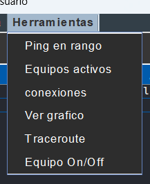

# ISFPP2024 
## Instancia Supervisada de Formación Práctica Profesional (ISFPP)

Si estas leyendo esto, probablemente no deberias estar aca
## Instrucciones de uso:
###  [Último Release](https://github.com/GadielDHorta068/ISFPP2024/releases/latest)
### [Documentación](https://github.com/GadielDHorta068/ISFPP2024/wiki)
### [Documentación Javadoc](https://github.com/GadielDHorta068/ISFPP2024/tree/release-2/Aplication/src/main/resources/assets/javadoc/index.html)

Debereas tener instalado Java 21 o superior en tu sistema.
Tambien deberas tene acceso a internet para la gestion de la Base de datos del programa

Se te sera solicitado en el primer inicio del programa, tu nombre y el idioma de preferencia para poder personalizar tu experiencia de usuario

En el panel principal encontraras 3 tablas con la información basica de los equipos existentes, las conexiones, y las ubicaciones disponibles.
Al hacer click en alguna, se mostrara en el panel derecho información detallada con las propiedades del objeto seleccionado.

Eliminar un objeto:
Deberas hacer click en uno de los objetos, luego dirigirte a la barra superior.
Seleccionar editar y luego eliminar, en caso de un equipo, se eliminara también sus conexiones a otros equipos. Y al querer eliminar una ubicacion se chekeara primero que no hayan equipos en ese sitio

Modificar un elemento:
Deberas hacer click en el objeto a modificar, luego en la barra superior seleccionaras en "Modificar", lo cual abrira un panel con sus propiedades a cambiar

Guardar/Cargar la red:
Deberas desplegar en la barra superior el menu "Archivo". En caso de guardar, se mostrara un menu para seleccionar un directorio. Se creara una carpeta /data en el mismo con los .txt pertenecientes a cada tipo de elemento.
En el caso de la carga, deberas navegar hasta el directorio que contenga /data, muy importante, seleccionar la carpeta padre y no data, ya que el programa busca la misma

Crear elementos:
En la barra superior, deberas presionar el boton de editar, en el mismo en sus opciones ofrecera crear una conexion, un equipo, una locacion o puertos nuevos

Editar puertos:
Deberas seleccionar un equipo de la tabla, luego presionar en editar puertos, se desplegara un menu con todos los puertos existentes donde podemos incrementar o decrementar siempre y cuando no se borren puertos en uso

Herramientas:
Esa seccion desplegable de la barra superior, otorgara diferentes utilidades para realizar analisis o visualizacion de datos sobre la LAN
Entre las caules nos encontraremos:
* Ping en rango: Al seleccionar una equipo y luego este item, nos hara un escaneo de todas las direcciones ip bajo esa denominacion
* Equipos Activos: Devolvera una lista con todos los equipos de la LAN que se encuentren activos. True si esta on, False si esta apagado o es inalcanzable
* Conexiones: Todos los equipos alcanzados por el seleccionado
* Ver Grafico: Se nos mostrara visualmente como esta compuesta la LAN
* Traceroute: Nos enseña el camino mas rapido entre dos equipos deseados
* Equipo ON/OFF : Simulara el apagado o encendido de un equipo

## Integrantes del grupo:
|🧑‍💻Gadiel D'Horta 
|👩‍💻Rocio 
|👨‍💻Ceferino

